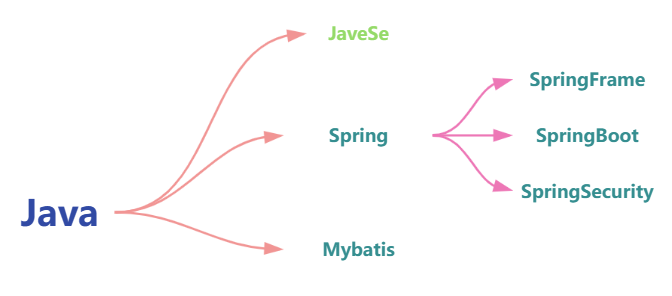

<h1>Open Documents</h1>

    

## Introduction  ✨

Open documents. Born to open! Open forever! Welcome to contributions.

Problems of existing documents on the Internet.
- Too many copies! There are so lots of copies of the original version that you don't know who is the first one. 
- Not official! The contents of existing documents have no references or don't been annotated by what they reference to. 

To solve these problems, we are here!

## Exsisting repositories  ⚡️

There are some kinds of baisc documents consisting of javase, linux and various frame such as netty, spring. 

---
Java Series：

Following below are links to repositories:
- javase：https://github.com/open-documents/doc-java-javase 
- netty：https://github.com/open-documents/doc-java-netty
- springframe：https://github.com/open-documents/doc-java-spring-frame
- springboot：https://github.com/open-documents/doc-java-spring-boot

